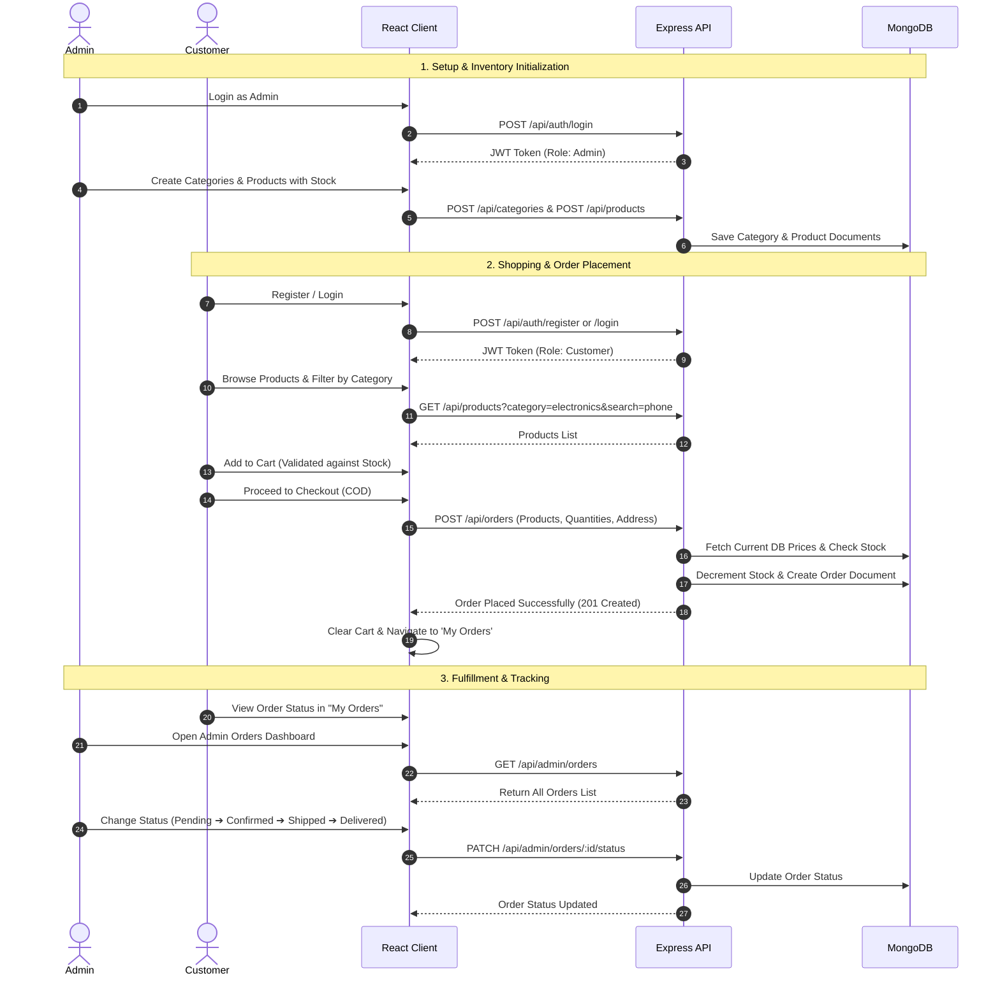

# 🛒 Mini E-Commerce Demo Project (MERN Stack)

A lightweight, clean, and full-featured **Mini E-Commerce Demo Web Application** built using the **MERN Stack** (MongoDB, Express.js, React.js, Node.js) with **Tailwind CSS**.

---

## 📌 Project Overview

This project is designed as an architectural blueprint and reference implementation for a clean, secure, and modern mini e-commerce platform. It features role-based access control (Customer and Admin), end-to-end shopping workflow (browsing, filtering, cart, Cash-on-Delivery checkout), real-time stock management, and an administrative management dashboard.

### Key Highlights
- **Role-Based Authentication**: Secure JWT-based authentication with bcrypt password hashing for Customers and Admins.
- **Dynamic Catalog**: Category filtering and real-time product search.
- **Stock-Safe Cart & Checkout**: Real-time stock validation preventing order placement beyond available inventory.
- **Server-Authoritative Pricing**: Total order amounts are calculated server-side using current MongoDB prices to prevent tampering.
- **Admin Management Hub**: Category management, Product management with stock control, and Order lifecycle management (`Pending` ➔ `Confirmed` ➔ `Shipped` ➔ `Delivered` ➔ `Cancelled`).
- **Responsive UI/UX**: Built with Tailwind CSS, supporting mobile, tablet, and desktop screens with glassmorphism touches, toast notifications, and interactive modals.

---

## 🛠️ Tech Stack

| Layer | Technology | Description |
| :--- | :--- | :--- |
| **Frontend** | React 18+ (Vite) | Fast, modular component-based single-page application |
| **Language** | JavaScript (ES6+) | Modern standard JavaScript |
| **Styling** | Tailwind CSS | Utility-first CSS framework for responsive, sleek design |
| **HTTP Client** | Axios | Interceptor-enabled client for REST API communication |
| **Icons & UI** | Lucide React / Heroicons | Modern, crisp iconography |
| **Backend** | Node.js + Express.js | High-performance asynchronous REST API server |
| **Database** | MongoDB + Mongoose | Schema-driven NoSQL database for flexible data modeling |
| **Authentication** | JWT (JSON Web Tokens) | Stateless token authorization for protected routes |
| **Security** | bcryptjs & CORS | Password hashing and secure cross-origin resource sharing |

---

## 📂 Project Structure

The project is structured into two decoupled, standalone modules:

```text
E-com/
├── client/                      # React Frontend (Vite + Tailwind CSS)
│   ├── public/                  # Static assets (favicons, images)
│   ├── src/
│   │   ├── api/                 # Axios instance and API service functions
│   │   ├── assets/              # Client-side icons, illustrations
│   │   ├── components/          # Reusable UI components (Navbar, Footer, Modal, Card, Table)
│   │   ├── context/             # React Context Providers (AuthContext, CartContext)
│   │   ├── hooks/               # Custom React hooks
│   │   ├── layouts/             # RootLayout, AdminLayout
│   │   ├── pages/               # Customer & Admin views
│   │   │   ├── admin/           # Admin Dashboard, Categories, Products, Orders
│   │   │   └── customer/        # Home, Products, ProductDetails, Cart, Checkout, Orders, Auth
│   │   ├── routes/              # App routing & Protected Route Guards
│   │   ├── App.jsx              # Application root
│   │   ├── index.css            # Tailwind directives and custom utility layers
│   │   └── main.jsx             # React DOM entry point
│   ├── index.html
│   ├── package.json
│   ├── tailwind.config.js
│   └── vite.config.js
│
├── server/                      # Node.js + Express REST API Backend
│   ├── config/                  # Database connection (db.js) & environment validation
│   ├── controllers/             # Request handlers (auth, category, product, order)
│   ├── middleware/              # Auth middleware, Admin guard, error handler
│   ├── models/                  # Mongoose Schemas (User, Category, Product, Order)
│   ├── routes/                  # Express API route declarations
│   ├── utils/                   # JWT helper tokens & validation utilities
│   ├── .env.example             # Environment variables template
│   ├── package.json
│   └── server.js                # Express app entry point
│
└── docs/                        # Comprehensive Architecture & API Documentation
    ├── ARCHITECTURE.md          # Architectural diagrams, auth flow, and system design
    ├── DATABASE_DESIGN.md       # Database schemas, relationships, indexing, and validation
    ├── API_SPECIFICATION.md     # Detailed REST endpoints, request/response contracts
    ├── FRONTEND_SPECIFICATION.md# UI/UX guidelines, page wireframes, state management
    ├── VALIDATION_AND_SECURITY.md # Deep-dive security, validation matrix & auth guards
    ├── DEMO_FLOW.md             # End-to-end interactive demo flow & test scenarios
    └── IMPLEMENTATION_PLAN.md   # Step-by-step development roadmap & verification plan
```

---

## 🔄 Main Demo Flow



---

## 🚀 Quick Start Guide

### Prerequisites
- [Node.js](https://nodejs.org/) (v18.x or higher)
- [MongoDB](https://www.mongodb.com/) (Local instance or MongoDB Atlas URI)
- Git & npm / yarn

### 1. Backend Setup
```bash
cd server
npm install
cp .env.example .env
# Edit .env with your MONGO_URI and JWT_SECRET
npm run dev
```

### 2. Frontend Setup
```bash
cd client
npm install
npm run dev
```
Open [http://localhost:5173](http://localhost:5173) in your browser.

---

## 📖 Detailed Documentation

Explore the in-depth documentation inside the [`docs/`](./docs) folder:

- 🏗️ **[System Architecture & Design](./docs/ARCHITECTURE.md)**: Role-based auth flow, middleware hierarchy, and directory architecture.
- 🗄️ **[Database Design & Schemas](./docs/DATABASE_DESIGN.md)**: Mongoose schemas, relationships, indexing, and stock integrity rules.
- 🌐 **[REST API Specification](./docs/API_SPECIFICATION.md)**: Complete API contract, parameters, status codes, and JSON payloads.
- 🎨 **[Frontend & UI/UX Specification](./docs/FRONTEND_SPECIFICATION.md)**: Tailwind styling, responsive layouts, components, and contexts.
- 🛡️ **[Validation & Security Specification](./docs/VALIDATION_AND_SECURITY.md)**: Comprehensive validation matrices, JWT crypto, and authorization middleware.
- 🎬 **[Demo Flow & Testing Guide](./docs/DEMO_FLOW.md)**: Step-by-step walkthrough, test accounts, cURL commands, and status lifecycle.
- 📋 **[Implementation Plan](./docs/IMPLEMENTATION_PLAN.md)**: Step-by-step phased execution guide from environment setup to deployment.

---

## 🔒 Security & Best Practices

1. **Server-Side Price Calculation**: Frontend prices are treated strictly as display elements. Orders re-fetch and multiply stored DB unit prices.
2. **Atomic Inventory Control**: Product stock decrements are verified before order creation to prevent negative inventory and race conditions.
3. **Password Security**: Passwords hashed using bcrypt with salt rounds >= 10.
4. **Token Security**: JWT tokens store minimal payload (`id`, `role`), signed with an expiration window.
5. **Role Separation**: Admin routes verify token authenticity and strictly enforce `role === 'admin'`.
