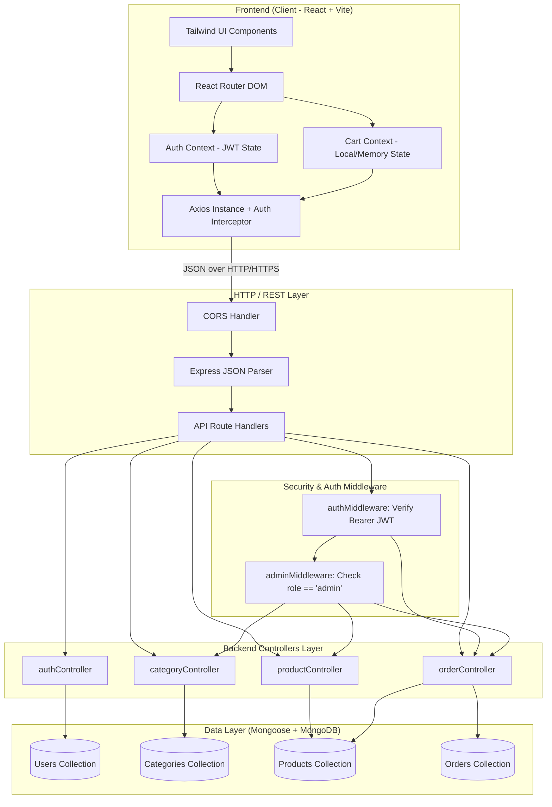
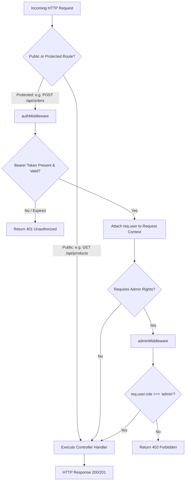
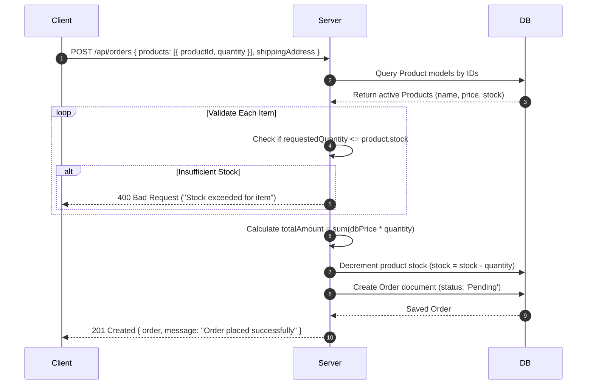

# 🏛️ System Architecture & Engineering Design

This document details the system design, layered architecture, data flow, and security mechanisms of the **Mini E-Commerce Demo Project**.

---

## 1. High-Level System Architecture

The application adopts a decoupled client-server architecture:
- **Client Tier**: Single Page Application (SPA) powered by React and Vite, styled with Tailwind CSS, utilizing Axios for API communication.
- **Server Tier**: Stateless RESTful API service built with Node.js and Express.js.
- **Database Tier**: MongoDB document database managed via Mongoose ODM for structured schemas and indexing.



---

## 2. Authentication & Authorization Architecture

The system uses stateless JSON Web Token (JWT) authentication with two distinct user personas:
1. **Customer (`role: 'customer'`)**: Can browse catalog, manage personal cart, place orders, and review past orders.
2. **Admin (`role: 'admin'`)**: Accesses administrative dashboard to manage categories, products, and update order statuses.

### 2.1 Password Security
- Passwords are never stored in plaintext.
- Upon registration or seed generation, passwords are automatically hashed with a salt (work factor = 10) using `bcryptjs` via Mongoose pre-save hooks or controller utilities.
- On login, `bcrypt.compare()` verifies the candidate password against the database hash.

### 2.2 JWT Token Lifecycle
1. User logs in with `email` and `password`.
2. Upon successful authentication, the server generates a signed JWT payload:
   ```json
   {
     "id": "650c1f1e2f1b2c001f8d1234",
     "role": "customer" // or "admin"
   }
   ```
   Signed using `JWT_SECRET` with an expiry window (e.g., `7d`).
3. The client receives the token and stores it in `localStorage`.
4. Axios attaches the token in the `Authorization` header for subsequent authenticated requests:
   ```http
   Authorization: Bearer <token>
   ```

### 2.3 Middleware Execution Pipeline



---

## 3. Stock Consistency & Order Placement Architecture

A critical architectural consideration in e-commerce is inventory integrity. Frontends cannot be trusted with pricing or stock calculations.

### Order Creation Safeguards:
1. **Frontend Role**:
   - Maintains client-side cart for instant UI responsiveness.
   - Prevents incrementing quantities beyond cached stock values.
   - Sends only `{ productId, quantity }` pairs and shipping details to `POST /api/orders`.
2. **Backend Role**:
   - Extracts `req.body.products`.
   - Queries MongoDB for each product by its ID in a single query or atomic batch.
   - **Verifies Stock**: For every item, if `product.stock < requestedQuantity`, the request is aborted immediately with `400 Bad Request` ("Insufficient stock for product: [Name]").
   - **Computes Price**: Resolves `totalAmount = sum(product.price * quantity)` using the authoritative database values.
   - **Decrements Inventory**: Updates product stock atomically (`$inc: { stock: -quantity }`).
   - **Creates Order Record**: Stores the order with snapshot prices, product names, quantities, and customer shipping address.
   - **Rollback Consideration**: If any part of the batch fails, no stock is permanently deducted.



---

## 4. Frontend Application Architecture

The React application uses a modern, hook-centric architecture:

### 4.1 State Management Structure
- **`AuthContext`**: Manages current user object, token persistence, login/logout actions, and role verification flags (`isAdmin`, `isAuthenticated`).
- **`CartContext`**: Manages the shopping cart array, total item count, computed cart total, quantity adjustments with stock limits, and local storage sync.
- **Component State**: Local `useState` and `useReducer` for form validation, search inputs, modal triggers, and loading spinners.

### 4.2 Route Guarding Architecture
- **Public Routes**: Accessible to all (Home, Product Catalog, Product Details, Login, Register).
- **Customer Protected Routes**: Accessible only to authenticated users (Cart, Checkout, My Orders). Unauthenticated visitors are redirected to `/login`.
- **Admin Protected Routes**: Accessible only when `user.role === 'admin'`. Unauthorized users are redirected to `/` or an unauthorized page.

---

## 5. Error Handling & Standards

All API responses follow a uniform JSON structure:

### Success Response Format:
```json
{
  "success": true,
  "data": { ... },
  "message": "Resource created / fetched successfully"
}
```

### Error Response Format:
```json
{
  "success": false,
  "message": "Human-readable error description",
  "errors": [ ... ] // Optional detailed field validation errors
}
```

### HTTP Status Codes:
- `200 OK`: Request succeeded.
- `201 Created`: Resource (User, Product, Category, Order) created.
- `400 Bad Request`: Validation failure, missing fields, or insufficient stock.
- `401 Unauthorized`: Missing or invalid JWT token.
- `403 Forbidden`: Authenticated user lacks permission (non-admin accessing admin routes).
- `404 Not Found`: Requested document does not exist.
- `500 Internal Server Error`: Unhandled server or database exception.
