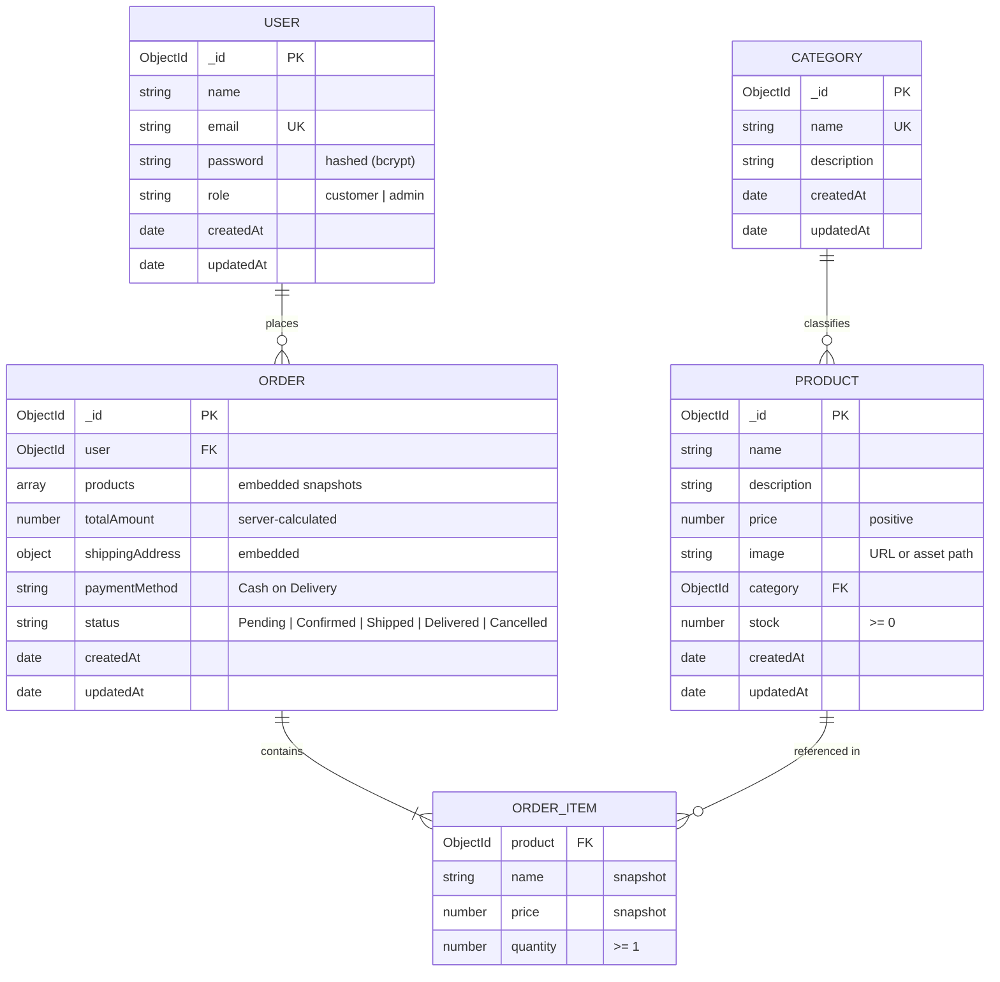

# 🗄️ Database Design & Data Modeling Specification

This document defines the database schemas, relationships, indexing strategies, validation constraints, and data integrity rules for the MongoDB database using Mongoose.

---

## 1. Entity Relationship (ER) Diagram



---

## 2. Model Schemas & Specifications

The project uses exactly four MongoDB models: **`User`**, **`Category`**, **`Product`**, and **`Order`**.

### 2.1 User Model (`User`)

Stores both customer and administrator accounts distinguished by the `role` enum.

| Field | Type | Validation / Constraints | Default | Description |
| :--- | :--- | :--- | :--- | :--- |
| `_id` | `ObjectId` | Auto-generated PK | Auto | Primary identifier |
| `name` | `String` | Required, trimmed, minlength: 2, maxlength: 50 | - | Full name of the user |
| `email` | `String` | Required, unique, lowercase, trimmed, valid email regex | - | User's email address (login credential) |
| `password` | `String` | Required, minlength: 6 (hashed with bcrypt) | - | Securely salted and hashed password |
| `role` | `String` | Enum: `['customer', 'admin']` | `'customer'` | Authorization access level |
| `createdAt`| `Date` | Timestamp | Auto | Creation timestamp |
| `updatedAt`| `Date` | Timestamp | Auto | Last updated timestamp |

#### Mongoose Schema Definition:
```javascript
const userSchema = new mongoose.Schema(
  {
    name: {
      type: String,
      required: [true, 'Please provide your full name'],
      trim: true,
      minlength: [2, 'Name must be at least 2 characters long'],
      maxlength: [50, 'Name cannot exceed 50 characters'],
    },
    email: {
      type: String,
      required: [true, 'Please provide an email address'],
      unique: true,
      lowercase: true,
      trim: true,
      match: [/^\S+@\S+\.\S+$/, 'Please provide a valid email address'],
    },
    password: {
      type: String,
      required: [true, 'Please provide a password'],
      minlength: [6, 'Password must be at least 6 characters long'],
      select: false, // Omit from default query projections for security
    },
    role: {
      type: String,
      enum: {
        values: ['customer', 'admin'],
        message: 'Role must be either customer or admin',
      },
      default: 'customer',
    },
  },
  { timestamps: true }
);
```

---

### 2.2 Category Model (`Category`)

Represents product classification categories managed exclusively by Administrators.

| Field | Type | Validation / Constraints | Default | Description |
| :--- | :--- | :--- | :--- | :--- |
| `_id` | `ObjectId` | Auto-generated PK | Auto | Primary identifier |
| `name` | `String` | Required, unique, trimmed, minlength: 2, maxlength: 50 | - | Name of category (e.g., Electronics, Fashion) |
| `description` | `String` | Optional, trimmed, maxlength: 250 | `''` | Summary of category offerings |
| `createdAt`| `Date` | Timestamp | Auto | Creation timestamp |
| `updatedAt`| `Date` | Timestamp | Auto | Last updated timestamp |

#### Mongoose Schema Definition:
```javascript
const categorySchema = new mongoose.Schema(
  {
    name: {
      type: String,
      required: [true, 'Category name is required'],
      unique: true,
      trim: true,
      minlength: [2, 'Category name must be at least 2 characters'],
      maxlength: [50, 'Category name cannot exceed 50 characters'],
    },
    description: {
      type: String,
      trim: true,
      default: '',
      maxlength: [250, 'Description cannot exceed 250 characters'],
    },
  },
  { timestamps: true }
);
```

---

### 2.3 Product Model (`Product`)

Maintains catalog information including pricing, inventory stock, and categorical associations.

| Field | Type | Validation / Constraints | Default | Description |
| :--- | :--- | :--- | :--- | :--- |
| `_id` | `ObjectId` | Auto-generated PK | Auto | Primary identifier |
| `name` | `String` | Required, trimmed, minlength: 2, maxlength: 120 | - | Display title of the product |
| `description` | `String` | Required, trimmed | - | Detailed description of features |
| `price` | `Number` | Required, min: [0.01, 'Price must be positive'] | - | Unit sale price in currency units |
| `image` | `String` | Required, trimmed, valid URL or image path | - | Product hero image URL |
| `category` | `ObjectId` | Required, Ref: `'Category'` | - | Parent category foreign key |
| `stock` | `Number` | Required, integer, min: [0, 'Stock cannot be negative'] | `0` | Available inventory count |
| `createdAt`| `Date` | Timestamp | Auto | Creation timestamp |
| `updatedAt`| `Date` | Timestamp | Auto | Last updated timestamp |

#### Mongoose Schema Definition:
```javascript
const productSchema = new mongoose.Schema(
  {
    name: {
      type: String,
      required: [true, 'Product name is required'],
      trim: true,
      minlength: [2, 'Product name must be at least 2 characters'],
      maxlength: [120, 'Product name cannot exceed 120 characters'],
    },
    description: {
      type: String,
      required: [true, 'Product description is required'],
      trim: true,
    },
    price: {
      type: Number,
      required: [true, 'Product price is required'],
      min: [0.01, 'Product price must be greater than zero'],
    },
    image: {
      type: String,
      required: [true, 'Product image URL is required'],
      trim: true,
    },
    category: {
      type: mongoose.Schema.Types.ObjectId,
      ref: 'Category',
      required: [true, 'Product category is required'],
    },
    stock: {
      type: Number,
      required: [true, 'Product stock is required'],
      min: [0, 'Stock cannot be negative'],
      validate: {
        validator: Number.isInteger,
        message: '{VALUE} is not an integer stock value',
      },
      default: 0,
    },
  },
  { timestamps: true }
);

// Text index for search functionality
productSchema.index({ name: 'text', description: 'text' });
```

---

### 2.4 Order Model (`Order`)

Represents customer orders with item snapshots, calculated monetary totals, and shipping details.

| Field | Type | Validation / Constraints | Default | Description |
| :--- | :--- | :--- | :--- | :--- |
| `_id` | `ObjectId` | Auto-generated PK | Auto | Primary identifier |
| `user` | `ObjectId` | Required, Ref: `'User'` | - | User reference who placed order |
| `products` | `Array` | Required, minlength: 1 item | `[]` | Embedded array of ordered items |
| `products[].product` | `ObjectId` | Required, Ref: `'Product'` | - | Reference to original product |
| `products[].name` | `String` | Required | - | Frozen snapshot of product name |
| `products[].price` | `Number` | Required, min: 0 | - | Frozen snapshot of unit price |
| `products[].quantity` | `Number` | Required, integer, min: 1 | `1` | Purchased item quantity |
| `totalAmount` | `Number` | Required, min: 0 | - | Server-computed monetary grand total |
| `shippingAddress` | `Object` | Required, embedded object | - | Physical delivery destination |
| `shippingAddress.name` | `String` | Required, trimmed | - | Recipient name |
| `shippingAddress.phone` | `String` | Required, trimmed | - | Recipient phone number |
| `shippingAddress.address` | `String` | Required, trimmed | - | Street address / apartment |
| `shippingAddress.city` | `String` | Required, trimmed | - | Delivery city |
| `shippingAddress.pincode` | `String` | Required, trimmed | - | Postal PIN / Zip code |
| `paymentMethod` | `String` | Enum: `['Cash on Delivery']` | `'Cash on Delivery'` | Fixed payment mechanism |
| `status` | `String` | Enum: `['Pending', 'Confirmed', 'Shipped', 'Delivered', 'Cancelled']` | `'Pending'` | Order fulfillment lifecycle state |
| `createdAt`| `Date` | Timestamp | Auto | Order creation timestamp |
| `updatedAt`| `Date` | Timestamp | Auto | Status update timestamp |

#### Mongoose Schema Definition:
```javascript
const orderItemSchema = new mongoose.Schema({
  product: {
    type: mongoose.Schema.Types.ObjectId,
    ref: 'Product',
    required: true,
  },
  name: {
    type: String,
    required: true,
  },
  price: {
    type: Number,
    required: true,
    min: 0,
  },
  quantity: {
    type: Number,
    required: true,
    min: [1, 'Quantity must be at least 1'],
  },
});

const orderSchema = new mongoose.Schema(
  {
    user: {
      type: mongoose.Schema.Types.ObjectId,
      ref: 'User',
      required: true,
    },
    products: {
      type: [orderItemSchema],
      required: true,
      validate: [val => val.length > 0, 'Order must contain at least one product'],
    },
    totalAmount: {
      type: Number,
      required: true,
      min: 0,
    },
    shippingAddress: {
      name: { type: String, required: [true, 'Recipient name is required'], trim: true },
      phone: { type: String, required: [true, 'Contact phone is required'], trim: true },
      address: { type: String, required: [true, 'Street address is required'], trim: true },
      city: { type: String, required: [true, 'City is required'], trim: true },
      pincode: { type: String, required: [true, 'Pincode is required'], trim: true },
    },
    paymentMethod: {
      type: String,
      default: 'Cash on Delivery',
      enum: ['Cash on Delivery'],
    },
    status: {
      type: String,
      enum: ['Pending', 'Confirmed', 'Shipped', 'Delivered', 'Cancelled'],
      default: 'Pending',
    },
  },
  { timestamps: true }
);

// Indexes for query optimization
orderSchema.index({ user: 1, createdAt: -1 });
orderSchema.index({ status: 1 });
```

---

## 3. Data Integrity & Safeguards

### 3.1 Historical Price Immutability (Price Snapshot)
If a product's price is updated in the catalog at a later date, past orders must reflect the exact amount charged at the moment of checkout. Therefore:
- The `Order` document embeds `products[].price` and `products[].name` as immutable snapshots.
- Future modifications or deletions of a `Product` document will never distort accounting figures of completed orders.

### 3.2 Inventory Race Condition Prevention
- When orders are placed, the server checks inventory against requested quantities.
- Decrement operations use atomic updates:
  ```javascript
  await Product.updateOne(
    { _id: item.productId, stock: { $gte: item.quantity } },
    { $inc: { stock: -item.quantity } }
  );
  ```
  This ensures stock never drops below zero even under concurrent requests.
