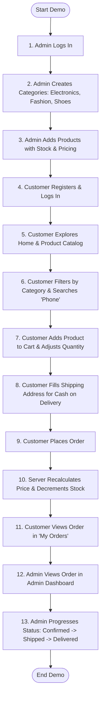

# 🎬 End-to-End Demo Flow & Testing Guide

This document outlines the step-by-step interactive demo flow, test scenarios, mock data, and state transitions for the **Mini E-Commerce Demo Project (MERN Stack)**.

---

## 📋 Table of Contents
1. [Overview](#1-overview)
2. [Seed / Test Accounts](#2-seed--test-accounts)
3. [End-to-End Flow Diagram](#3-end-to-end-flow-diagram)
4. [Step-by-Step Walkthrough](#4-step-by-step-walkthrough)
   - [Phase 1: Admin Initialization](#phase-1-admin-initialization)
   - [Phase 2: Customer Journey & Purchase](#phase-2-customer-journey--purchase)
   - [Phase 3: Order Lifecycle & Fulfillment](#phase-3-order-lifecycle--fulfillment)
5. [Edge Cases & Error Handling Tests](#5-edge-cases--error-handling-tests)
6. [API Verification via cURL](#6-api-verification-via-curl)

---

## 1. Overview

The primary objective of this demo flow is to demonstrate complete end-to-end synergy across all components of the MERN stack without external dependencies (no third-party payment gateways, no email servers, no external CDN dependencies):

- **Admin Operations**: Categories, Products, and Order Status management.
- **Customer Operations**: Browsing, Filtering, Live Search, Stock-Restricted Cart, and Cash on Delivery Checkout.
- **Backend Integrity**: Price tampering prevention, atomic stock decrement, and JWT role-based route guards.

---

## 2. Seed / Test Accounts

For demonstration and testing purposes, standard seeded credentials will be used:

### 👤 Administrator
* **Role**: `admin`
* **Email**: `admin@ecom.local`
* **Password**: `Admin@123`
* **Capabilities**: Access to `/admin/*` routes, category CRUD, product CRUD, and order status updates.

### 👤 Customer
* **Role**: `customer`
* **Name**: `Alex Johnson`
* **Email**: `alex@example.com`
* **Password**: `Customer@123`
* **Shipping Address**:
  - **Phone**: `9876543210`
  - **Address**: `Flat 402, Green Avenue, High Street`
  - **City**: `Mumbai`
  - **Pincode**: `400001`

---

## 3. End-to-End Flow Diagram



---

## 4. Step-by-Step Walkthrough

### Phase 1: Admin Initialization

#### Step 1: Admin Login
1. Navigate to `/login`.
2. Enter email: `admin@ecom.local` and password: `Admin@123`.
3. Click **Login**.
4. The client saves JWT token and redirects to `/admin/dashboard`.
5. Verify the Admin sidebar displays navigation links for:
   - **Dashboard**
   - **Categories**
   - **Products**
   - **Orders**

#### Step 2: Create Categories
1. Navigate to `/admin/categories`.
2. Click **Add Category**.
3. Create the following initial categories:
   - **Name**: `Electronics`, **Description**: `Smartphones, accessories, and gadgets.`
   - **Name**: `Fashion`, **Description**: `Men's and women's apparel and accessories.`
   - **Name**: `Shoes`, **Description**: `Casual, athletic, and formal footwear.`
4. Verify all 3 categories appear in the responsive data table.
5. Test category editing (e.g., update description) and verify instant table update.

#### Step 3: Add Products
1. Navigate to `/admin/products`.
2. Click **Add Product**.
3. Add initial sample items:
   - **Product 1**:
     - **Name**: `Ultra HD Wireless Headphones`
     - **Category**: `Electronics`
     - **Price**: `$129.99`
     - **Stock**: `15`
     - **Image**: `https://images.unsplash.com/photo-1505740420928-5e560c06d30e?w=500`
     - **Description**: `Noise-cancelling over-ear wireless headphones.`
   - **Product 2**:
     - **Name**: `Classic Minimalist Watch`
     - **Category**: `Fashion`
     - **Price**: `$89.50`
     - **Stock**: `8`
     - **Image**: `https://images.unsplash.com/photo-1523275335684-37898b6baf30?w=500`
     - **Description**: `Stainless steel quartz watch with genuine leather strap.`
   - **Product 3**:
     - **Name**: `Pro Trail Running Shoes`
     - **Category**: `Shoes`
     - **Price**: `$119.00`
     - **Stock**: `5`
     - **Image**: `https://images.unsplash.com/photo-1542291026-7eec264c27ff?w=500`
     - **Description**: `Lightweight breathable athletic shoes with grip sole.`
4. Verify table shows correct images, stock counts, category names, and prices.
5. Admin clicks **Logout**.

---

### Phase 2: Customer Journey & Purchase

#### Step 4: Customer Registration & Login
1. Navigate to `/register`.
2. Fill fields:
   - **Name**: `Alex Johnson`
   - **Email**: `alex@example.com`
   - **Password**: `Customer@123`
   - **Confirm Password**: `Customer@123`
3. Click **Create Account**.
4. System automatically logs in user and redirects to the **Home** page.
5. Header shows user profile badge and cart icon with count `0`.

#### Step 5: Catalog Browsing & Search
1. On the **Products** page (`/products`), verify responsive product grid displays all 3 items.
2. Click category filter button `Electronics`:
   - Grid updates to display only `Ultra HD Wireless Headphones`.
3. In the search input, type `Watch`:
   - Click `All` filter, search shows `Classic Minimalist Watch`.
4. Clear search to restore full catalog.

#### Step 6: Product Details & Cart Management
1. Click on `Pro Trail Running Shoes` to open `/products/:id`.
2. Inspect product details, pricing, available stock (`5 in stock`), and description.
3. Click **Add to Cart**.
4. Toast notification displays: *"Pro Trail Running Shoes added to cart"*.
5. Navbar cart badge updates to `1`.
6. Navigate to `/cart`.
7. Increase quantity to `2`.
8. Verify item total updates automatically (`$238.00`).
9. Try to increase quantity beyond stock limit (`5`):
   - The `+` button is disabled, and a notification warns that maximum stock has been reached.

#### Step 7: Checkout & Order Placement
1. On `/cart`, click **Proceed to Checkout**.
2. On `/checkout`, verify:
   - Order summary lists items, quantities, and total amount.
   - Payment method is fixed to **Cash on Delivery (COD)**.
3. Fill shipping address details:
   - **Name**: `Alex Johnson`
   - **Phone**: `9876543210`
   - **Address**: `Flat 402, Green Avenue, High Street`
   - **City**: `Mumbai`
   - **Pincode**: `400001`
4. Click **Place Order**.
5. Client submits `POST /api/orders`.
6. Server verifies stock, recalculates total from database unit prices, creates the order document, decrements product stock from `5` to `3`, and returns `201 Created`.
7. Client clears local cart state and redirects to `/my-orders`.

#### Step 8: View Order in "My Orders"
1. Verify the newly placed order is displayed with status badge **Pending** (yellow).
2. Expand order to review items, quantities, snapshot price, and shipping details.
3. Verify total matches expected value.

---

### Phase 3: Order Lifecycle & Fulfillment

#### Step 9: Admin Order Review & Status Update
1. Logout from customer account and log in as `admin@ecom.local`.
2. Navigate to `/admin/orders`.
3. Verify Alex Johnson's order is listed with:
   - Order ID
   - Customer name & email
   - Items count & Total amount
   - Current status: `Pending`
   - Date placed
4. Click **View Details** to open order modal.
5. In the status dropdown, select **Confirmed**:
   - Status updates in real-time with badge color change (blue).
6. Update status to **Shipped** (indigo/purple).
7. Update status to **Delivered** (green).

#### Step 10: Inventory Verification
1. Navigate to `/admin/products`.
2. Find `Pro Trail Running Shoes`.
3. Confirm that stock has decremented from `5` to `3`.
4. Switch back to public website (`/products`):
   - The product card now reflects `3 in stock`.

---

## 5. Edge Cases & Error Handling Tests

| # | Test Scenario | Trigger Action | Expected Outcome |
|---|:---|:---|:---|
| 1 | Duplicate Registration | Register with `alex@example.com` again | HTTP 400 with message *"User with this email already exists"*. |
| 2 | Password Mismatch | Register with differing password & confirm password | Frontend validation blocks submit; shows inline warning. |
| 3 | Password Too Short | Register with password `< 6` characters | Validation blocks submit; displays *"Password must be at least 6 characters"*. |
| 4 | Price Tampering | Malicious user injects price `0.01` in POST `/api/orders` | Backend ignores submitted price, fetches price from DB, correctly charges full price. |
| 5 | Out of Stock | Order quantity `4` when available stock is `3` | Backend responds with HTTP 400 *"Insufficient stock available"*; order aborted. |
| 6 | Unauthorized Admin Route | Customer token attempts `POST /api/products` | HTTP 403 Forbidden with *"Access denied. Admin privileges required."* |
| 7 | Unauthenticated Order | Anonymous user attempts `POST /api/orders` | HTTP 401 Unauthorized with *"Authorization token required"*. |
| 8 | Delete Category with Products | Admin attempts deleting category containing active products | Confirmation modal warns or backend prevents orphaned products. |

---

## 6. API Verification via cURL

### 1. Customer Registration
```bash
curl -X POST http://localhost:5000/api/auth/register \
  -H "Content-Type: application/json" \
  -d '{
    "name": "Alex Johnson",
    "email": "alex@example.com",
    "password": "Customer@123",
    "confirmPassword": "Customer@123"
  }'
```

### 2. User / Admin Login
```bash
curl -X POST http://localhost:5000/api/auth/login \
  -H "Content-Type: application/json" \
  -d '{
    "email": "admin@ecom.local",
    "password": "Admin@123"
  }'
```

### 3. Fetch Catalog with Query Params
```bash
curl -X GET "http://localhost:5000/api/products?category=electronics&search=headphones"
```

### 4. Place Cash on Delivery Order
```bash
curl -X POST http://localhost:5000/api/orders \
  -H "Content-Type: application/json" \
  -H "Authorization: Bearer <CUSTOMER_JWT_TOKEN>" \
  -d '{
    "items": [
      { "product": "<PRODUCT_OBJECT_ID>", "quantity": 2 }
    ],
    "shippingAddress": {
      "name": "Alex Johnson",
      "phone": "9876543210",
      "address": "Flat 402, Green Avenue",
      "city": "Mumbai",
      "pincode": "400001"
    }
  }'
```

### 5. Admin Update Order Status
```bash
curl -X PATCH http://localhost:5000/api/admin/orders/<ORDER_OBJECT_ID>/status \
  -H "Content-Type: application/json" \
  -H "Authorization: Bearer <ADMIN_JWT_TOKEN>" \
  -d '{ "status": "Confirmed" }'
```
