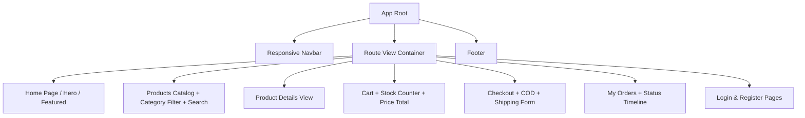
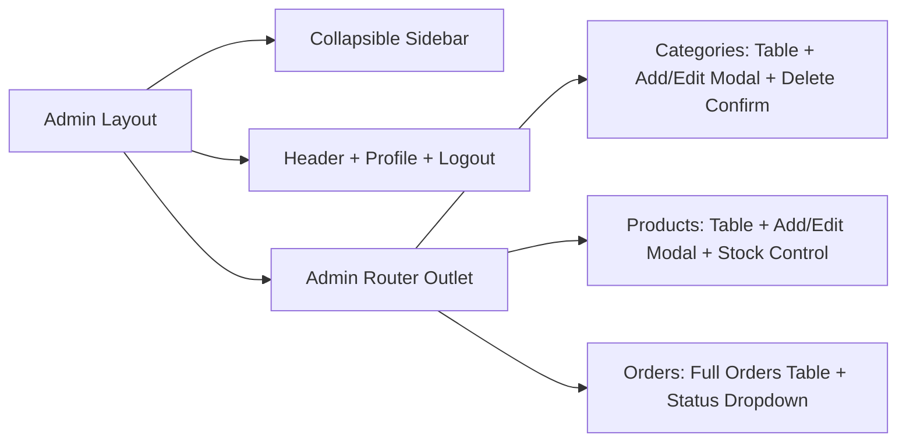
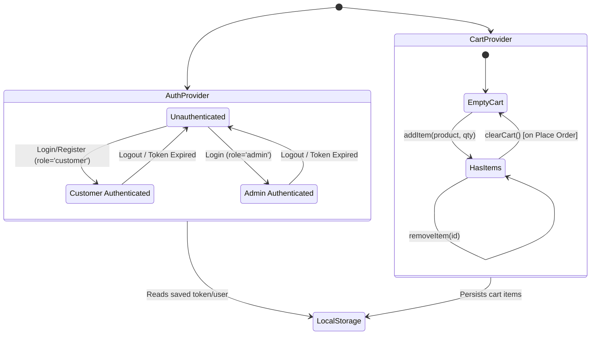

# 🎨 Frontend & UI/UX Specification

This document details the user interface architecture, design system, component hierarchy, state management, and user interaction flows for the React client.

---

## 1. Design System & Aesthetics (Tailwind CSS)

The frontend is built using **React (Vite)** and styled with **Tailwind CSS**. The design focuses on clean lines, high readability, responsive breakpoints, and modern subtle micro-interactions.

### 1.1 Color Palette
- **Primary / Brand**: Indigo & Violet (`indigo-600`, `indigo-700`, `violet-600`) for primary buttons, active tabs, and highlights.
- **Surface / Background**: Slate & Gray neutrals (`bg-slate-50` for app body, `bg-white` for cards, `border-slate-200`).
- **Text**: `text-slate-900` (headings), `text-slate-600` (body), `text-slate-400` (subtext/muted).
- **Accents & Status**:
  - `Pending`: Amber (`bg-amber-100 text-amber-800 border-amber-200`)
  - `Confirmed`: Blue (`bg-blue-100 text-blue-800 border-blue-200`)
  - `Shipped`: Purple (`bg-purple-100 text-purple-800 border-purple-200`)
  - `Delivered`: Emerald (`bg-emerald-100 text-emerald-800 border-emerald-200`)
  - `Cancelled`: Rose (`bg-rose-100 text-rose-800 border-rose-200`)
  - `Danger / Delete`: Rose (`bg-rose-600 hover:bg-rose-700`)

### 1.2 Typography & Iconography
- **Font Family**: Modern sans-serif (`Inter`, `system-ui, -apple-system, sans-serif`).
- **Icons**: Lucide React (`ShoppingBag`, `ShoppingCart`, `Search`, `Filter`, `Trash2`, `Edit`, `Plus`, `Menu`, `X`, `ChevronRight`).

---

## 2. Page Specifications & Layouts

### 2.1 Public & Customer Storefront

#### 1. Home Page (`/`)
- **Hero Banner**: Engaging welcome title, clear call-to-action button ("Shop Now").
- **Category Highlights**: Quick-link pills/cards to popular categories.
- **Featured Products**: Responsive grid of top catalog items.

#### 2. Products Page (`/products`)
- **Category Filter Pills**: `All | Electronics | Fashion | Shoes | ...` with active pill highlighting.
- **Search Bar**: Live input with instant filtering or debounced query updates.
- **Responsive Product Grid**:
  - Desktop: 4 columns (`grid-cols-1 sm:grid-cols-2 md:grid-cols-3 lg:grid-cols-4`).
  - Tablet: 2 to 3 columns.
  - Mobile: 1 column.
- **Product Card Elements**:
  - Crisp product thumbnail image.
  - Category badge tag.
  - Product name (truncated after 2 lines).
  - Price formatting (e.g. `$99.99`).
  - Stock badge (`In Stock: 12` or `Out of Stock`).
  - "Add to Cart" button (disabled if `stock === 0`).

#### 3. Product Details Page (`/products/:id`)
- High-resolution hero image gallery.
- Title, category, full description.
- Stock availability indicator.
- Quantity selector constrained between 1 and available `stock`.
- Direct "Add to Cart" button with instant toast notification.

#### 4. Cart Page (`/cart`)
- List of items with thumbnail, title, unit price, quantity modifier (`-` and `+` controls), subtotal, and remove icon (`Trash2`).
- **Stock Limit Guard**: The `+` button is disabled when quantity equals current available product stock.
- Order Summary card:
  - Subtotal amount
  - Shipping fee (Free / Fixed)
  - Grand total
  - "Proceed to Checkout" button.
- Empty State: Clean vector illustration / icon with "Your cart is empty" and a "Browse Products" button.

#### 5. Checkout Page (`/checkout`)
- **Protected**: Only accessible when logged in.
- **Shipping Address Form**:
  - Full Name
  - Phone Number
  - Street Address
  - City
  - Postal Pincode
- **Payment Method**: Radio option fixed to **Cash on Delivery (COD)**.
- **Order Review**: Summary of purchased items and total price.
- **Place Order CTA**: Submits order, validates stock, decrements DB inventory, clears cart, and redirects to `/my-orders`.

#### 6. My Orders Page (`/my-orders`)
- Table or card list of customer orders with:
  - Order ID & placement date
  - List of purchased products (name, quantity, snapshot price)
  - Total monetary amount
  - Status Badge (`Pending`, `Confirmed`, `Shipped`, `Delivered`, `Cancelled`)
- Empty state if no orders exist yet.

#### 7. Authentication Pages (`/login` & `/register`)
- Clean centered card design.
- Toggle between Register and Login.
- Register form: Name, Email, Password, Confirm Password with client-side matching validation.
- Login form: Email, Password.

---

### 2.2 Admin Dashboard (`/admin/*`)

#### Layout Structure
- **Sidebar**: Fixed/collapsible navigation sidebar with links to:
  - 📂 **Categories**
  - 📦 **Products**
  - 📑 **Orders**
  - 🚪 **Exit to Storefront**
- **Admin Categories Page (`/admin/categories`)**:
  - "Add Category" trigger button opening a modal.
  - Clean responsive table: Name, Description, Actions (Edit, Delete).
  - Confirmation modal for delete operations.
- **Admin Products Page (`/admin/products`)**:
  - "Add Product" trigger button.
  - Table: Thumbnail, Product Name, Category, Price, Stock level, Actions.
  - Stock highlights: red alert tag if `stock === 0`.
  - Add/Edit Modal with fields: Name, Description, Price, Image URL, Category selector, Stock integer.
  - Delete confirmation dialog.
- **Admin Orders Page (`/admin/orders`)**:
  - Table: Order ID, Customer Name & Email, Ordered Items count, Total Amount, Date, Status.
  - Interactive Status Selector: dropdown or select box with states (`Pending`, `Confirmed`, `Shipped`, `Delivered`, `Cancelled`).
  - Changes trigger instant `PATCH /api/admin/orders/:id/status` with toast confirmation.
  - Order Detail Modal: displays recipient shipping address, phone, and itemized breakdown.

---

## 3. Client State Management Architecture

### 3.1 `AuthContext`
- **State**:
  - `user`: `{ id, name, email, role }` or `null`
  - `token`: String or `null`
  - `loading`: Boolean
  - `isAuthenticated`: `Boolean(user)`
  - `isAdmin`: `user?.role === 'admin'`
- **Methods**:
  - `login(email, password)`
  - `register(formData)`
  - `logout()`

### 3.2 `CartContext`
- **State**:
  - `cartItems`: Array of `{ product: { _id, name, price, image, stock }, quantity }`
  - `totalItems`: Computed total count
  - `totalPrice`: Computed grand sum
- **Methods**:
  - `addToCart(product, quantity = 1)`: If product already in cart, increments quantity up to `product.stock`.
  - `updateQuantity(productId, newQty)`: Enforces `1 <= newQty <= product.stock`.
  - `removeFromCart(productId)`
  - `clearCart()`

---

## 4. UI/UX Feedback Components

- **Toast Notifications**: Built-in or light toaster for immediate user feedback on Add to Cart, Login, Status Change, and errors.
- **Loading Spinners / Skeletons**: Displayed during product queries, category fetching, and checkout submission.
- **Empty States**: Friendly illustration with instructional text when the cart has no items or search returns 0 results.
- **Confirmation Modals**: Two-step confirmation for deleting categories and products ("Are you sure you want to delete this product? This action cannot be undone.").
