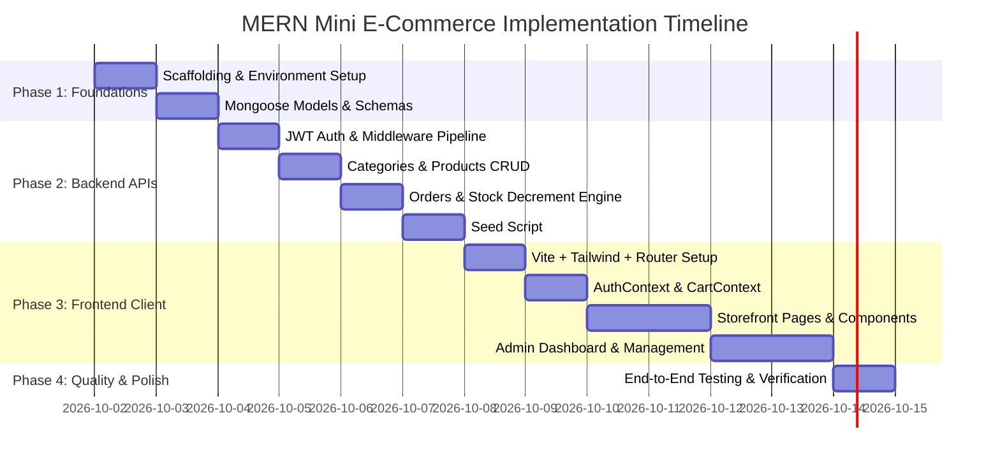

# 📋 Implementation Roadmap & Phased Execution Plan

This document outlines the step-by-step development roadmap for constructing the **Mini E-Commerce Demo Project** from scratch to full deployment.

---

## 📅 Phased Execution Overview

---

## 📌 Phase 1: Foundations & Backend Scaffolding

### Tasks:
1. **Initialize Project Repository**:
   - Verify folder structure with `/client` and `/server`.
   - Setup `.gitignore` covering `node_modules`, `.env`, and `dist`.
2. **Backend Environment Setup**:
   - Initialize `/server/package.json`.
   - Install dependencies: `express`, `mongoose`, `dotenv`, `cors`, `jsonwebtoken`, `bcryptjs`.
   - Install dev-dependencies: `nodemon`.
   - Configure `.env.example` with `PORT`, `MONGO_URI`, and `JWT_SECRET`.
3. **Database Connection**:
   - Implement `server/config/db.js` with retry logic and error logging.

---

## 📌 Phase 2: Data Models & Backend APIs

### Tasks:
1. **Mongoose Models**:
   - Implement `User.js` with bcrypt password hashing hook.
   - Implement `Category.js` with unique name indexing.
   - Implement `Product.js` with positive price and non-negative stock validation.
   - Implement `Order.js` with embedded snapshots for products and shipping address.
2. **Authentication Middleware**:
   - Implement `authMiddleware` to decode JWT and attach `req.user`.
   - Implement `adminMiddleware` to restrict access strictly to `req.user.role === 'admin'`.
3. **API Controllers & Routes**:
   - **Auth**: `POST /api/auth/register`, `POST /api/auth/login`.
   - **Categories**: Full CRUD (`GET`, `POST`, `PUT`, `DELETE`).
   - **Products**: Full CRUD (`GET` with search/category filters, `GET /:id`, `POST`, `PUT`, `DELETE`).
   - **Orders**:
     - `POST /api/orders`: Validate stock availability, calculate price from DB, atomic decrement stock, save order.
     - `GET /api/orders/my-orders`: Retrieve customer's order history.
     - `GET /api/admin/orders`: Retrieve all customer orders.
     - `PATCH /api/admin/orders/:id/status`: Update status enum.
4. **Seed Database Script**:
   - Create `server/seeder.js` to populate:
     - 1 Admin account (`admin@example.com` / `admin123`)
     - 1 Customer account (`customer@example.com` / `customer123`)
     - Default categories (Electronics, Fashion, Shoes)
     - Sample products with realistic images and stock levels.

---

## 📌 Phase 3: Frontend Scaffolding & State Management

### Tasks:
1. **Client Setup**:
   - Initialize React SPA via Vite in `/client`.
   - Install dependencies: `axios`, `react-router-dom`, `lucide-react`.
   - Configure Tailwind CSS (`tailwind.config.js` and `src/index.css`).
2. **API Client**:
   - Configure Axios instance (`src/api/axios.js`) with base URL and JWT request interceptor.
3. **Context Providers**:
   - `AuthContext.jsx`: Persists user state, handles login, register, and logout.
   - `CartContext.jsx`: Handles add to cart, quantity modifier, stock limit checks, subtotal, and cart clearing.
4. **Routing & Guards**:
   - `ProtectedRoute.jsx`: Restricts customer routes to authenticated users.
   - `AdminRoute.jsx`: Restricts admin routes to `user.role === 'admin'`.

---

## 📌 Phase 4: Public Storefront Development

### Tasks:
1. **Shared Layout Components**:
   - `Navbar`: Responsive navigation, brand logo, search link, cart badge count, user profile dropdown.
   - `Footer`: Clean links, copyright, and technology badges.
2. **Pages**:
   - **Home**: Hero section, category quick navigation, featured products.
   - **Products**: Category filter pills (`All | Electronics | Fashion | Shoes`), search input, and responsive card grid.
   - **Product Details**: Product gallery, detailed description, quantity picker (max capped at stock), "Add to Cart" button.
   - **Cart**: Item list, quantity increment/decrement, remove button, summary card, and empty cart state.
   - **Checkout**: Shipping address form (Name, Phone, Address, City, Pincode), COD payment indicator, order confirmation.
   - **My Orders**: List of user orders with statuses (`Pending`, `Confirmed`, etc.) and item breakdown.
   - **Login & Register**: Polished forms with input validation and toggle link.

---

## 📌 Phase 5: Admin Panel Development

### Tasks:
1. **Admin Layout**:
   - Responsive sidebar with links to Categories, Products, and Orders.
   - Top bar with admin indicator and quick exit to storefront.
2. **Category Management (`/admin/categories`)**:
   - Responsive data table.
   - "Add Category" and "Edit Category" modal dialogs.
   - Delete confirmation dialog.
3. **Product Management (`/admin/products`)**:
   - Table showing thumbnail, name, price, category, and current stock.
   - "Add / Edit Product" form modal with input validation.
   - Delete confirmation modal.
4. **Order Management (`/admin/orders`)**:
   - Comprehensive orders table.
   - Order detail drawer/modal showing customer shipping info and purchased items.
   - Status update dropdown (`Pending` ➔ `Confirmed` ➔ `Shipped` ➔ `Delivered` ➔ `Cancelled`) with instant save.

---

## 📌 Phase 6: Verification & End-to-End Demo Checklist

### Complete Demo Workflow Checklist:
- [ ] Admin logs in with administrative credentials.
- [ ] Admin navigates to Categories and adds a new category (e.g. "Accessories").
- [ ] Admin navigates to Products and creates a new product with stock = 5.
- [ ] Admin verifies the new product is visible in the public storefront.
- [ ] A new customer registers and logs in.
- [ ] Customer searches for the product and filters by category.
- [ ] Customer adds the product to cart (attempting to add more than stock is prevented).
- [ ] Customer proceeds to checkout and fills in shipping address.
- [ ] Customer places Cash-on-Delivery order.
- [ ] System automatically calculates order total from DB price and reduces product stock by order quantity.
- [ ] Customer views placed order in "My Orders" with status `Pending`.
- [ ] Admin logs in, opens Admin Orders table, and sees the new order.
- [ ] Admin changes status from `Pending` to `Confirmed`, then to `Shipped`.
- [ ] Customer refreshes "My Orders" and sees real-time status update.
